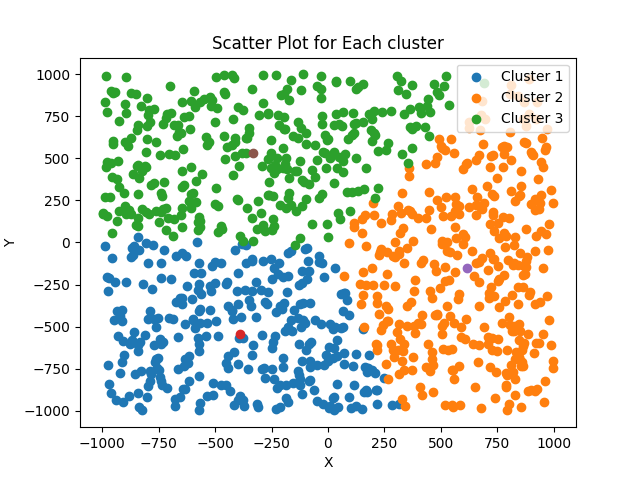
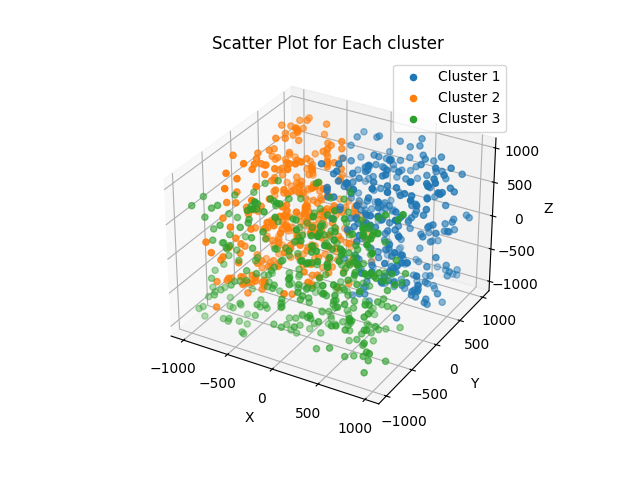
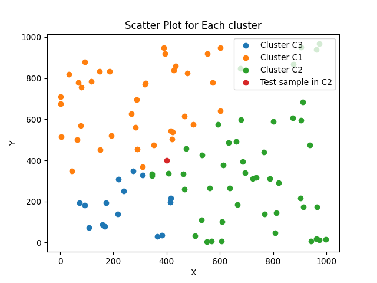

# KNN Project
**Course:** Pattern Recognition

**Professor:** Dr.Shervan Fekri Ershad

**Student:** Erfan Riahi

## Explanation - `cluster.py`
In this project I use clustering to create my own dataset.

In `cluster.py` at first we should set below parameters:
* `n_samples`: _number of samples_
* `n_features`: _number of features(dimension)_
* `n_cluster`: _number of clusters_
* `n_iteration`: _how much this algorithm run_

### Create initial data
In `create_data` function, randomly create points between 0 to 1000 and according to `n_cluster` value, we will have `n_cluster` centers

### Clustering part
In this project we have three distance standard:

1. **Euclidean distance**: $$d(p,q)=\sqrt{\sum_{i=0}^{n}(q_i-p_i)^2}$$

2. **City Block distance**: $d(p, q)=\sum_{i=0}^{n}{|q_i-p_i|}$

3. **Sorensen distance**: $d(p, q)=\sum_{i=0}^{n}{|q_i-p_i|} / \sum_{i=0}^{n}{(q_i + p_i)}$

Find the minimum distance between centers and other points and make clusters. then update centers by averaging between each cluster samples and reach a new centers. this process repeat `n_iteration` times.

### Plot 2D & 3D
If `n_features` equal 2 or 3, we can see the output visually. for example if `n_samples=1000, n_features=2, n_cluster=3, n_iteration=10`, the output will be:

and if `n_samples=1000, n_features=3, n_cluster=3, n_iteration=10`, the output will be:

### Save data
After finishing the algorithm, we save the data into a CSV file named `dataset.csv`. CSV file will something like this:

F1 | F2 | F3 | Label
---|----|----|-----
308|807 |589 | C1
629| 262|702|C1
-216| 985|866|C2
720| 446|27|C1
504| 387|104|C3
696| 369|505|C2

## Explanation - `KNN.py`
In `KNN.py` we read the dataset and split the features and labels. then get the `k` number and `sample_test` from user.

If the dimensional of `test_sample` and `features` is not the same, we continue to get `sample_test` from user again until the right dimensional `sample_test` entered.

### KNN algorithm
In KNN also we have the same three standards for distance. I use the three standards and we can see the result the end.

1. Find distance between `test_sample` and other points
2. Separate `k` minimum distance 
3. Assign label to `test_sample` by majority of minimum distances

### Output
`k=3, test_sample=[400, 400]` the output will be this:

---
The 3 nearest neighbor with Euclidean distance is: [(63.29, 'C2'), (85.8, 'C2'), (89.89, 'C1')]

test sample label: C2

----

The 3 nearest neighbor with CityBlock distance is: [(69.0, 'C2'), (121.0, 'C2'), (122.0, 'C1')]

test sample label: C2

----

The 3 nearest neighbor with Sorensen distance is: [(0.04471808165910564, 'C2'), (0.07192575406032482, 'C1'), (0.07567879838243789, 'C2')]

test sample label: C2

### Plot 2D
If number of features is 2 we can see the output visually. the **red point** is our `test_sample`.

---
**_THE END_**
